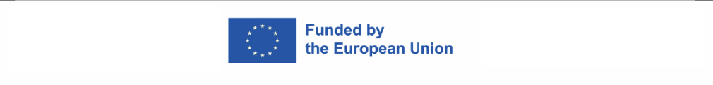

# YOLO Image Annotator for escriptorium

This project is part of and funded by [ATRIUM](https://atrium-research.eu/), a European Commission-funded research initiative aimed at advancing frontier knowledge in the arts and humanities.




The YOLO Image Annotator is a Chrome extension designed for annotating images using the YOLOv8 model. It loads an image/page from an eScriptorium document, processes it, and provides object detection capabilities.

## Features
- Load images from supported websites.
- Annotate images using a YOLO model (must be provided as `model.json` and `.bin` files).
- Automatically saves API token for quicker access.

## Loading the Extension in Chrome
1. Go to `chrome://extensions/`.
2. Enable **developer mode**.
3. Click **load unpacked** and select the `dist` folder.

## Usage
1. **Enter Your API Token**: Before using the extension, you must enter your API token. This is required to interact with eScriptorium and load the images for annotation.
2. **Add a YOLOv8 Model**: Click the **Add Model** button, which will open the options page of the extension. Here, you can select a folder containing the model files:
   - The folder should include:
     - `model.json` and corresponding `.bin` files (required)
     - `metadata.yaml` (optional, if your model includes metadata)
3. The selected model files will be stored in the **IndexedDB** and will be accessible from the popup. The model will be added to the list of loaded models, allowing you to switch between different models if needed.
4. **Start Annotating**: Once the model is loaded and selected, click the **Start** button in the popup to fetch the current image and begin annotation.

## Exporting YOLOv8 Models to TensorFlow.js
- To use a YOLOv8 model in this extension, you must export it to TensorFlow.js format. For detailed instructions on exporting your model, refer to the [Ultralytics documentation](https://docs.ultralytics.com/integrations/tfjs).

## Developer Guide
### Setting Up the Project
1. **Clone the Repository**:
   ```bash
   git clone https://gitlab.com/haguili/yolo-escriptorium.git
   cd your-project-folder
   ```
2. **Install Dependencies**:
   ```bash
   npm install
   ```
3. **Build the Project**:
   You have two options for building the project:
   - Using `npx`:
     ```bash
     npx webpack --config webpack.config.js
     ```
   - Using `npm`:
     ```bash
     npm run build
     ```
   - Both commands will create the `dist` folder containing the built files.

### Running the Extension in Development
1. Make sure to rebuild with either `npx webpack --config webpack.config.js` or `npm run build` after making changes.
2. Load the `dist` folder in Chrome as described above.

### Running CI/CD
- The project uses GitLab CI/CD for automated builds and releases.
- To trigger the CI/CD pipeline, create a new tag and push it to the repository. The pipeline will build and package the extension and create a release with the generated zip file.

### Notes for Development
- Ensure all dependencies are up to date with `npm install`.
- Use `npx webpack --config webpack.config.js` or `npm run build` to bundle the project before testing.
- For debugging, you can use the Chrome developer tools on the extension popup and content scripts.